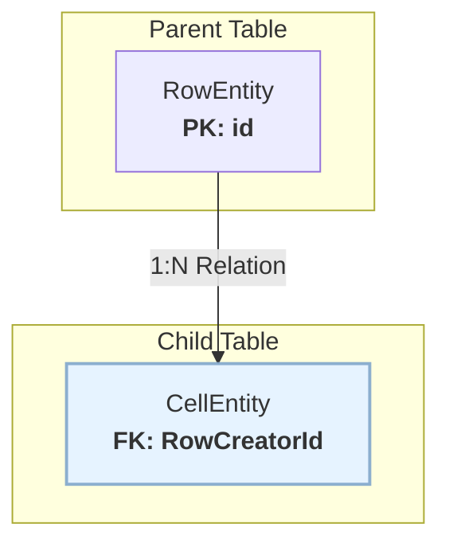
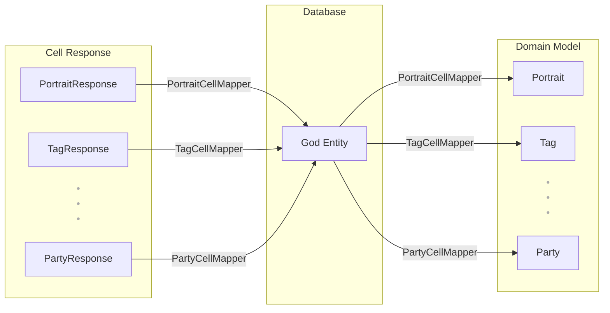
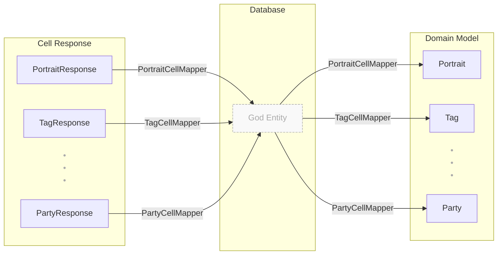
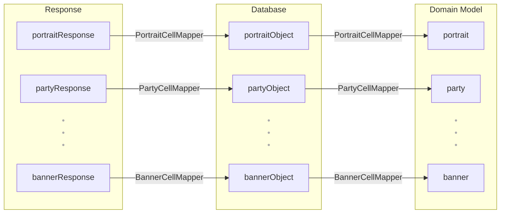

# 이상적인 탐색탭

## 개요

왓챠 탐색탭은 세로로 나열된 Row 안에, 가로로 나열된 Cell이 들어있는 중첩 리스트 구조다.


### Paging
사용자가 스크롤함에 따라 계속해서 새로운 Row를 보여주어야 하므로 Paging 3를 사용한다.   
또한 이어보기 Cell의 Progress처럼 데이터가 어디서든 변경될 수 있기 때문에, RemoteMediator를 통해 모든 데이터를 Room에 저장하고 관리한다.

### Table 구조


## 거대한 Cell Table

Row는 다양한 Cell을 감싸는 껍데기일 뿐, 탐색탭 구조의 핵심은 결국 Cell이다.

초기 설계 단계에서는 다양한 Cell 타입에 공통적으로 사용되는 속성(title, thumbnail 등)이 많았기 때문에, 이를 하나의 CellEntity 테이블로 통합하여 관리했다.   
하지만 탐색탭에 더 다채로운 콘텐츠를 담으려는 시도가 늘어나면서 상황은 달라졌다.   
Tag Cell, Party Cell 등 저마다 고유한 데이터를 가진 새로운 Cell 타입이 추가될 때마다 CellEntity의 칼럼은 계속해서 늘어나야 했다.

특정 Cell 타입에만 필요한 속성들이 다른 Cell 타입에게는 불필요한 null 값으로 채워지면서, 테이블은 점차 비대해졌고, 결국 CellEntity는 100개가 넘는 속성을 가진, 거대한 테이블(God Entity) 이 되고 말았다.



## 문제 : 의도 왜곡
가장 큰 문제는 Response 모델의 의도가 domain model 까지 전달되지 않고 왜곡된 다는 것이다.

여기 두 얘시가 있다.

### 원래 의도 : 명확한 규칙 (Response)
API Response는 각 타입의 책임이 명확

```kotlin
// PortraitCell은 'posterUrl'이 반드시 있어야 한다는 의도를 가짐
data class PortraitCellResponse(
    val posterUrl: String, // Non-nullable
    ...
) : CellResponse()

// TagCell 'filter'가 반드시 있어야 한다는 의도를 가짐
data class TagCellResponse(
    val filter: String, // Non-nullable
    ...
) : CellResponse()
```

타입 자체가 데이터의 유효성을 컴파일 시점에 보장한다.

### 왜곡된 의도 : 약해진 규칙 (God Entity)
이들을 CellEntity로 Mapping하면서 규칙이 약해진다.

```kotlin
@Entity
data class CellEntity(
    // Portrait 때문에 필요한 속성
    val posterUrl: String?, // TagCell 때문에 Nullable로 변경됨

    // Tag 때문에 필요한 속성
    val filter: String?   // PortraitCell 때문에 Nullable로 변경됨
)
```

PortraitCell의 필수 값 posterUrl이 CellEntity에서는 **Nullable**으로 변해 모델의 핵심 의도가 깨졌다.

### 그래서 발생하는 문제
* **불필요한 코드 강요** : PortraitCell 저장할 때, 아무 관련 없는 filter 필드에 null을 넣어주는 불필요한 매핑 코드가 강제
* **책임의 전가** : 데이터 유효성을 보장하던 모델(타입)의 책임이, 이제는 cellType을 확인하고 filter의 null 여부를 처리해야 하는 개발자에게로 넘어왔다.

## 하지만 애매한 Entity 나누기

### 관리 비용 증가
관리해야할 Entity, DAO, Relation 정의가 Cell Type 개수 만큼 쌍으로 늘어난다.

### 이질적인 Relation 정의 필요 🤦

```kotlin
data class RowAndCell(
    @Embedded
    val row: RowEntity,
    @Relation(
        entity = PortraitCellEntity::class,
        parentColumn = "id",
        entityColumn = "rowId"
    )
    val portraitCells: List<PortraitCellEntity>,
    @Relation(
        entity = PartyCellEntity::class,
        parentColumn = "id",
        entityColumn = "rowId"
    )
    val partyCells: List<PartyCellEntity>,
    @Relation(
        entity = BannerCellEntity::class,
        parentColumn = "id",
        entityColumn = "rowId"
    )
    val bannerCells: List<BannerCellEntity>,
    ...
)
```

## 아이디어

엄격한 스키마가 오히려 여러 모델을 포용하기 위해 스스로를 왜곡하는 아이러니가 발생하고 있는데 엄격한 Schema 정의가 없으면 어떨까?



## NOSQL

토이 프로젝트에서 사용했던 DynamoDB가 떠올랐다.

```kotlin
class PortriatCellMapper() {

    fun toItem(cell: PortraitCellResponse): Map<String, AttributeValue> {
        return mapOf(
            "id" to AttributeValue.builder().s(cell.id).build(),
            "cellType" to AttributeValue.builder().s(cell.cellType).build(),
            "posterUrl" to AttributeValue.builder().s(cell.posterUrl).build(),
            ...
        )
    }

    fun fromItem(item: Map<String, AttributeValue>): PortraitCell {
        return PortraitCell(
            id = item["id"]?.s() ?: error("id is missing"),
            cellType = item["cellType"]?.s() ?: error("cellType is missing"),
            posterUrl = item["posterUrl"]?.s() ?: error("posterUrl is missing"),
            ...
        )
    }
}
```

결과적으로 데이터베이스는 모델의 의도를 왜곡하지 않는 유연한 저장소가 되고, 각 모델의 엄격한 규칙(Non-nullable 등)은 각자의 Mapper 안에서 온전히 보존된다!

## 라이브러리 선택

앞선 Mapper 아이디어를 안드로이드 클라이언트에서 실현하기 위해, 다음 조건을 만족하는 로컬 데이터베이스 라이브러리를 찾아보았다.
* NoSQL & Schema-less : 유연한 데이터 구조를 가질 것
* React to Changes : 데이터 변경에 실시간으로 반응할 수 있을 것
* Kotlin Friendly : Suspend와 Flow 지원할 것
* Well-supported : 활발한 커뮤니티와 꾸준한 유지보수가 이루어질 것

하지만 안드로이드 생태계에서 이 모든 조건을, 특히 스키마리스를 완벽하게 만족하는 안정적인 로컬 DB를 찾기란 쉽지 않았다.

다른 대안을 찾던 중, 탐색탭의 핵심 구조인 **Row와 그 안의 Cell 리스트**라는 수직적 계층 구조를 객체 그래프(Object Graph) 형태로 그대로 저장할 수 있는 Realm의 방식에 눈길이 갔다.

이는 Room에서 복잡한 @Relation과 JOIN으로 해결해야 했던 문제를 훨씬 직관적으로 풀어낼 수 있는 가능성을 의미했다.

스키마리스는 문제의 본질이 아닌 단순 아이디어,   
정말 피하고 싶었던 것은 **하나의 거대한 Entity가 모델의 의도를 왜곡하는 상황**이다.

Realm은 스키마가 있더라도 각 Cell 타입을 독립된 객체로 정의하게 해주어, 이 본질적인 문제를 해결하는 현실적인 대안이었다.

## Realm

### Object-Oriented DB : 관계가 아닌 그래프

Realm이 Room과 같은 RDB와 근본적으로 다른 점은 데이터를 관계(Relation)가 아닌 객체 그래프(Object Graph) 중심으로 다룬다는 것이다.

**Room의 방식**
* RowEntity와 CellEntity는 물리적으로 분리된 테이블에 저장
* 두 테이블은 ForeignKey를 통해 논리적 관계를 맺은다.
* 데이터를 가져올 때는 JOIN 연산을 통해 분리된 데이터를 매번 다시 합쳐야 한다. @Relation은 이 과정을 편하게 해주지만, 본질은 분리된 데이터를 조립하는 것이다.

```kotlin
data class RowWithCells(
    @Embedded val row: RowEntity,
    @Relation(
        parentColumn = "id",
        entityColumn = "rowCreatorId"
    )
    val cells: List<CellEntity>
)
```

**Realm의 방식**
* RowObject는 RealmList<CellObject> 속성을 통해 Cell 객체들의 참조를 직접 소유
* 객체와 그에 속한 하위 객체 리스트가 하나의 그래프로 연결되어 저장
* 따라서 관계를 표현하기 위한 별도의 JOIN 연산이 필요 없으며, Row 객체를 조회하면 그에 속한 Cell 리스트는 자연스럽게 함께 따라온다.

```kotlin
open class RowObject : RealmObject {
    @PrimaryKey var id: String = ""
    var title: String = ""
    var cells: RealmList<CellObject> = realmListOf() // Cell 리스트를 직접 소유
}

open class CellObject : RealmObject {
    @PrimaryKey var id: String = ""
    var thumbnail: String = ""
    // 부모를 가리키는 FK가 필요 없음
}
```

이러한 Realm의 아키텍처 덕분에, UI가 요구하는 중첩된 데이터 구조를 훨씬 효율적이고 직관적으로 모델링하고 조회할 수 있다.

## 유사 Polymorphism 지원 👍

탐색탭의 Row들은 저마다 다른 Type에 Cell 리스트를 가진다.

Realm은 상속 기반의 다형성을 직접 지원하지 않지만, RealmAny 타입을 통해 이 문제를 간단하게 해결한다.   
RealmAny는 어떤 RealmObject든 담을 수 있는 일종의 유연한 컨테이너다.

```kotlin
open class RowObject : RealmObject {
    @PrimaryKey var id: String = ""
    var title: String = ""
    var cells: RealmList<RealmAny> = realmListOf() // 어떤 Cell 타입이든 담을 수 있다.
}

open class PortraitCellObject : RealmObject { ... }
open class PartyCellObject : RealmObject { ... }
```

Room의 경우, 이 문제를 해결하려면 앞서 이질적인 Relation 정의에서 살펴본 RowWithTypedCells와 같은 접근이 필요하다.   
결국 God Entity 문제가 이번에는 God DTO(Data Transfer Object) 문제로 옮겨온 것과 같다.

## 단점

### 스키마 구현 문제
realm 객체 정의 시 kotlin data class를 사용하지 못 한다.   
Kotlin data class는 기본적으로 immutable하고 final이어서 Realm이 요구하는 open, mutable 객체 및 내부 프록시 기반 변경 감지 기능과 충돌하기 때문이다.

그로인해 mapper가 더러워지고 기본 값을 정의해야한다.

### Inheritance / Polymorphism 문제

앞서 언급했듯 Realm은 상속 기반 다형성을 지원하지 않는다.

**RealmAny 사용의 불안정성**
* RealmList<RealmAny>에 모든 Cell을 담고 런타임에 asRealmObject<T>()로 꺼내야 하지만
* 잘못된 타입 캐스팅 시 예외(NPE 등)가 발생하거나 데이터가 손상될 수 있으며, 컴파일 타임 검증이 불가능하다.

상상하던 구현
```kotlin
sealed class CellObject : RealmObject {
    abstract var id: String
    abstract var thumbnail: String
    ...
}

class PortraitCellObject : CellObject {
    ...
}

class PartyCellObject : CellObject {
    ...
}

class RowObject : RealmObject {
    var cells: RealmList<CellObject> = realmListOf()
    ...
}
```

## 결론

RDB 입장에서 나누기 애매했던 Entity를 오브젝트 지향 DB인 Realm를 활용해 Cell type 별 Object를 정의해 명확하게 나눴다.


